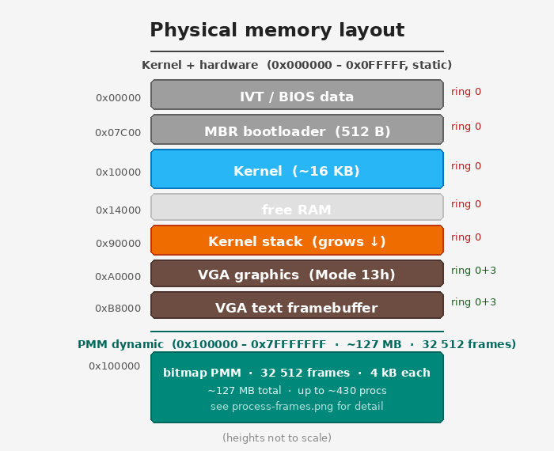
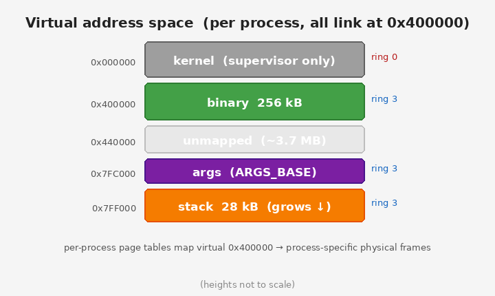

# YOLO-OS

A minimal bare-metal x86 operating system for IBM PC, built from scratch.
Runs in QEMU. Educational and intentionally simple.

## Quick start

```bash
# Install dependencies (Debian/Ubuntu)
sudo apt install nasm gcc gcc-multilib binutils qemu-system-x86 dosfstools mtools python3-pexpect

# Build and run
make
make run

# Run automated tests
make test
```

---

## Architecture

- **CPU**: x86, 32-bit protected mode; kernel in ring 0, user programs in ring 3
- **Boot**: 16-bit MBR bootloader → ATA PIO LBA read → jumps to 32-bit kernel at `0x10000`
- **Video**: VGA text mode 80×25 (`0xB8000`); user programs may switch to Mode 13h graphics
- **Keyboard**: PS/2 polling, scan code set 1, US QWERTY, arrow keys supported
- **Filesystem**: FAT16 on the same IDE disk image, read/write via ATA PIO; supports
  absolute and relative paths, subdirectories, create/delete/rename
- **Timer**: PIT 8253 channel 0 at 100 Hz (IRQ0 → INT 32); `g_ticks` counter drives
  `sleep()` and the preemptive round-robin scheduler — the only active hardware IRQ;
  all others remain masked.
- **Syscalls**: 20 syscalls via `int 0x80` — EAX = number, EBX/ECX/EDX = arguments,
  return value in EAX. Cover I/O (`read`/`write`), file access (`open`/`close`),
  directory ops (`readdir`/`mkdir`/`unlink`/`rename`/`chdir`), process management
  (`exec`/`exit`), memory (`sbrk`), timing (`sleep`), and hardware helpers
  (`setpos`/`clrscr`/`getchar`).
- **Programs**: freestanding flat 32-bit binaries linked at `0x400000`, stored in `/bin` on
  FAT16 without extension. Include `bin/os.h` for all syscall wrappers — no libc needed.
  Multiple processes run concurrently; the shell supports `cmd &` to launch a program in the
  background while the shell stays interactive.
- **Physical memory (PMM)**: bitmap allocator manages ~127 MB (0x100000–0x7FFFFFFF,
  32 512 frames of 4 KB). Each process receives its own set of frames: page directory,
  page table, 256 KB binary area, 28 KB stack, 4 KB kernel stack (~300 KB total).
  Up to ~430 processes can exist simultaneously.
- **Virtual memory / paging**: every process has its own page directory (CR3). The kernel
  is mapped supervisor-only in PDE[0] (shared `pt_kernel`); the user binary occupies PDE[1]
  (per-process page table, ring 3). PDE[2–511] use 4 MB PSE large pages to give the kernel
  identity access to all physical RAM without per-process kernel mappings. U/S bits enforce
  ring separation; a ring-3 page fault (segfault) is caught, reported, and the process is
  terminated cleanly. Process nesting depth is unlimited.
- **Heap / malloc**: user programs can grow their heap via the `sbrk` syscall
  (virtual 0x440000–0x7F7FFF, mapped on demand in 4 KB pages). `bin/malloc.h` provides a
  portable first-fit free-list allocator on top of `sbrk` — include it in any user program,
  no kernel changes required.

### Process control block (PCB)

Each entry in `g_procs[32]` holds everything the kernel needs to manage one process:

```
struct process
┌──────────────────────────────────────────────────────────────────┐
│ pid              int       process ID                            │
│ state            enum      UNUSED / READY / RUNNING / WAITING /  │
│                            SLEEPING / ZOMBIE                     │
├──────────────────────────────────────────────────────────────────┤
│  Page tables                                                     │
│  cr3             uint      physical address of page directory    │
│  parent_cr3      uint      parent's page directory (FG exec)     │
│  phys_frames[0]  uint      page directory frame                  │
│  phys_frames[1]  uint      user page table frame                 │
│  n_frames        int       count of binary + stack frames        │
├──────────────────────────────────────────────────────────────────┤
│  Kernel stack (ring-0)                                           │
│  phys_kstack     uint      physical address of 4 KB ring-0 stack │
│  saved_esp       uint ──►  saved register frame on phys_kstack:  │
│                            [gs fs es ds  edi esi ebp esp         │
│                             ebx edx ecx eax  int_no err_code     │
│                             eip cs eflags  user_esp user_ss]     │
├──────────────────────────────────────────────────────────────────┤
│  Foreground exec context                                         │
│  saved_exec_ret_esp  uint  parent's exec_ret_esp (nested FG)     │
├──────────────────────────────────────────────────────────────────┤
│  Misc                                                            │
│  heap_break      uint      current sbrk() break                  │
│  wakeup_tick     uint      g_ticks value to wake from sleep      │
│  is_background   int       0 = foreground,  1 = background       │
│  saved_cwd_cluster uint    FAT16 CWD at launch (restored on exit)│
│  exit_code       int       exit code                             │
└──────────────────────────────────────────────────────────────────┘
```

The scheduler (IRQ0, 100 Hz) saves the current process's register frame pointer into
`saved_esp`, picks the next READY process, switches CR3 and `tss.esp0`, and returns the new
`saved_esp` to `isr_common` which does `mov esp, eax` before `iret`.

---

## Disk layout


The single `disk.img` (4 MB raw) holds both the kernel and the filesystem:

| Region | Content |
|--------|---------|
| Sector 0 | Boot sector — MBR code + FAT16 BPB (patched by `scripts/patch_boot.sh`) |
| Sectors 1 – 128 | Kernel binary (controlled by `KERNEL_SECTORS` in Makefile) |
| Sector 129+ | FAT16 filesystem — FAT tables, root directory (`BOOT.TXT`, `bin/`), data clusters |

User programs live in the `/bin` directory on the FAT16 partition (stored without the `.bin` extension).
`BOOT.TXT` in the root holds a persistent boot counter.

---

## Memory layout





Physical memory above 1 MB is managed by a bitmap PMM. Each process receives its own set of
frames (~300 KB: page directory, page table, 256 KB binary, 28 KB stack, 4 KB kernel stack).
All processes link at virtual `0x400000`; per-process page tables map that address to the
process's own physical frames. Up to ~430 processes can run simultaneously.

| Physical address | Content | Ring |
|-----------------|---------|------|
| `0x00000` | IVT / BIOS data area | 0 only |
| `0x07C00` | MBR bootloader (512 B) | 0 only |
| `0x10000` | Kernel (~16 KB) | 0 only |
| `0x90000` | Kernel stack top (grows down) | 0 only |
| `0xA0000` | VGA graphics framebuffer (Mode 13h, 320×200) | 0 + 3 |
| `0xB8000` | VGA text framebuffer (80×25) | 0 + 3 |
| `0x100000+` | PMM dynamic region (~127 MB) — per-process frames allocated here | — |

Virtual address space per process (all programs link at `0x400000`):

| Virtual address | Content |
|----------------|---------|
| `0x000000–0x3FFFFF` | Kernel (supervisor only) |
| `0x400000–0x43FFFF` | Binary (256 KB, ring 3) |
| `0x7FC000` | `ARGS_BASE` — argument string |
| `0x7FF000` | Stack top (grows down, ring 3) |

---

## Shell

The kernel boots, calls the PMM, allocates a process for `/bin/sh`, and execs it.
All user interaction happens inside the shell process.

### Built-in commands

| Command | Description |
|---------|-------------|
| `cd [dir]` | Change directory; `cd` or `cd /` → root; `cd ..` → parent |
| `clear` | Clear the screen |
| `exit` | Exit the shell (kernel halts) |
| `__exit` | Signal QEMU to quit (used by automated tests only) |

### Running programs

| Syntax | Description |
|--------|-------------|
| `<name>` | Run `/bin/<name>` in the foreground; shell waits for it to finish |
| `<name> <args>` | Run with argument string (accessible via `get_args()`) |
| `<name> &` | Run in the background; shell prompt returns immediately |
| `<name> <args> &` | Background with arguments |

### Examples

```
> ls                    # list files and dirs in cwd (dirs shown with trailing /)
> ls bin                # list contents of bin/
> cd bin                # enter a subdirectory (prompt changes to /bin> )
> cd ..                 # go up to parent
> hello                 # run /bin/hello
> xxd BOOT.TXT          # run /bin/xxd with argument "BOOT.TXT"
> xxd /bin/hello        # absolute path argument
> vi notes.txt          # open notes.txt in the text editor
> vi /docs/notes.txt    # create/open file via absolute path
> demo                  # start the graphics demo
> free                  # show memory usage in kB
> t_bg &                # run in background; prompt returns immediately
> mkdir docs            # create a subdirectory in cwd
> rm file.txt           # delete file (prompts y/N)
> mv foo.txt bar.txt    # rename within current directory
```

### Editing

- Left/right arrow keys move the cursor within the current line; insert and delete work mid-line
- Up/down arrows are ignored (no history)
- Prompt shows cwd when not at root: `/bin> ` (green)

### Paths

- Programs are loaded from `/bin`; file syscalls inside the program use cwd
- Absolute and multi-component paths are supported (e.g. `/bin/hello`, `/docs/sub/file.txt`)
- Maximum path length is 127 characters; `cd` prints `cd: path too long` and file operations
  return "cannot open" if the limit is exceeded

---

## User programs

All programs are freestanding 32-bit flat binaries linked at `0x400000`, run in ring 3.
They are stored in `/bin` on FAT16 without a file extension.
Include `bin/os.h` to get syscall wrappers — no libc, no linking required.

### sh

The interactive shell (first user process launched by the kernel).

### hello

Prints "Hello, World!" and exits.

### xxd

Hex dump of a file (16 bytes per line, ASCII sidebar).

```
> xxd BOOT.TXT
> xxd notes.txt
```

### vi

A vi-like text editor.

| Key | Action |
|-----|--------|
| Arrow keys | Move cursor |
| `i` | Enter insert mode |
| `o` | Open new line below, enter insert mode |
| `x` | Delete character under cursor |
| `Esc` | Return to normal mode |
| `:w` | Save |
| `:q` | Quit (refuses if unsaved) |
| `:q!` | Force quit |
| `:wq` / `:x` | Save and quit |

### demo

VGA Mode 13h (320×200, 256 colours) snow animation.
Press `q` to quit. The kernel automatically restores text mode on exit.

### ls

Lists files and directories in the current directory (or a given directory argument).
Directories are shown with a trailing `/`; files show their size in bytes.

### rm

Deletes a file or empty directory. Prompts `[y/N]` before removing.

### mkdir

Creates a subdirectory in the current directory.

### mv

Renames a file or directory within the current directory. Usage: `mv <src> <dst>`

### free

Displays physical and virtual memory usage in kB.

```
         total       used       free
Phys:   130048 kB     592 kB   129456 kB
Virt:     8192 kB     568 kB     7624 kB   (2 procs)
```

- **Phys**: PMM stats — total managed RAM (~127 MB), allocated frames, free frames
- **Virt**: per-process virtual address space (4 MB each) × number of active processes; used = mapped pages

---

## Process execution model

### Our model vs. Linux/POSIX

Linux programs run new processes via **`fork()` + `exec*()`**:

```
shell (parent)              child
    │                         │
    ├─── fork() ──────────────┤  duplicate the entire process
    │                    exec*(prog)  replace child's image
    │                         │  program runs
    │    waitpid()            │
    └───────────────◄─────────┘  parent unblocks (foreground)

    background:  fork() + exec*(), parent skips waitpid()
```

The child inherits open file descriptors, environment variables, signal masks, and other
process state from the parent before calling `exec*()` to replace its code. This is the
standard Unix model.

YOLO-OS uses a simpler **spawn model** (closer to POSIX `posix_spawn()`):

```
shell (parent)              child
    │                         │
    ├─── SYS_EXEC ────────────┤  kernel creates child from /bin directly
    │    (EXEC_FG)       program runs
    │    parent → WAITING     │
    └───────────────◄─────────┘  parent unblocks on child exit (foreground)

    background (EXEC_BG):  child → READY, parent continues immediately
```

There is no `fork()`. The kernel reads the binary from FAT16, allocates fresh page tables and
a kernel stack, and runs the child. The child does not inherit open files or any other parent
state — it starts with a clean slate. `exec()` returns the exit code (foreground) or the
child's PID (background via `exec_bg()`).

### Why not fork()?

`fork()` requires either copy-on-write (complex MMU bookkeeping) or a full copy of all user
pages (~300 KB per process). Both add significant kernel complexity. For an educational OS
with a single shell process and simple programs that don't need to inherit state, a direct
spawn model is sufficient and much simpler.

---

## Test programs

Programs with a `t_` prefix are installed in `/bin` but are intended exclusively for the
automated test suite (`make test`). They are not interactive user utilities.

| Program   | What it does |
|-----------|--------------|
| `t_segflt` | Writes to a supervisor-only address → page fault → "Segmentation fault" |
| `t_panic`  | Calls `kernel_panic()` with an optional message → red panic screen + halt |
| `t_mall1`  | Tests `malloc`: alloc, write, free+reuse, large alloc, exhaustion |
| `t_mall2`  | Allocates 4 KB with `malloc`, writes within bounds, then overflows → segfault |
| `t_sleep`  | Calls `sleep(1000)`, verifies return value 0, prints "sleep: OK" |
| `t_bg`     | Sleeps 300 ms then prints "bg: OK"; used to test background execution |

---

## Adding a new user program

1. Create `bin/myprog.c`, include `bin/os.h`, implement `void main(void)`.
2. Add to `Makefile`:
   ```makefile
   USER_BINS += $(BUILD)/myprog.bin

   $(BUILD)/myprog.o: bin/myprog.c bin/os.h | $(BUILD)
       $(CC) $(CFLAGS) -c $< -o $@

   $(BUILD)/myprog.elf: $(BUILD)/myprog.o bin/user.ld
       $(LD) -m elf_i386 -T bin/user.ld $< -o $@

   $(BUILD)/myprog.bin: $(BUILD)/myprog.elf
       $(OBJCPY) -O binary $< $@
   ```
3. `make` and then run `myprog` in the shell.

Use `get_args()` to read the argument string passed after the program name.

---

## Syscall reference

Include `bin/os.h`. All functions are `static inline` wrappers around `int 0x80`.

---

```c
void exit(int code);
```
Terminate the program and return to the shell.

---

```c
int write(int fd, const char *buf, int len);
```
Write `len` bytes from `buf` to `fd`. Returns number of bytes written, or `-1` on error.
- `fd=1` — stdout: output appears on VGA and COM1 serial
- `fd≥2` — open file: data is accumulated in a 16 KB kernel buffer, flushed to disk on `close()`

---

```c
int read(int fd, char *buf, int len);
```
Read up to `len` bytes into `buf`. Returns number of bytes read, or `-1` on error.
- `fd=0` — stdin: blocks until newline; echoes typed characters; returns the whole line including `\n`
- `fd≥2` — open file: reads sequentially from current position

---

```c
int open(const char *path, int flags);
```
Open a file. Returns a file descriptor (`≥2`), or `-1` on error.
- `flags=O_RDONLY` (0) — read: file is loaded into a kernel buffer
- `flags=O_WRONLY` (1) — write: creates the file if it does not exist, truncates if it does
- `path` may be a simple filename, a relative path (`subdir/file.txt`), or an absolute path
  (`/bin/hello`); maximum 127 characters — returns `-1` if exceeded

---

```c
int close(int fd);
```
Close `fd`. Returns `0` on success, `-1` on error.
For `O_WRONLY` files: flushes the kernel buffer to FAT16 on disk.

---

```c
int get_char(void);
```
Blocking read of one raw keystroke; no echo. Returns the character as an `unsigned char` value.
Arrow keys return the following constants (defined in `os.h`):

| Constant | Value |
|----------|-------|
| `KEY_UP` | `0x80` |
| `KEY_DOWN` | `0x81` |
| `KEY_LEFT` | `0x82` |
| `KEY_RIGHT` | `0x83` |

---

```c
int get_char_nonblock(void);
```
Non-blocking variant of `get_char`. Returns `0` immediately if no key is available.

---

```c
void set_pos(int row, int col);
```
Move the VGA hardware cursor. `row`: 0–24, `col`: 0–79.

---

```c
int getpos(void);
```
Return the current VGA cursor position as `row * 256 + col`.

---

```c
void clrscr(void);
```
Clear the entire text screen and move the cursor to (0, 0).

---

```c
int readdir(struct direntry *buf, int max);
```
Fill `buf` with up to `max` entries from the current directory. Returns the count.
Each `struct direntry` has `char name[13]`, `unsigned int size`, `int is_dir`.

---

```c
int chdir(const char *name);
```
Change the current directory. Returns `0` on success, `-1` if not found.

---

```c
int unlink(const char *name);
```
Delete a file or empty directory. Returns `0`, `-1` (not found), or `-2` (directory not empty).

---

```c
int os_mkdir(const char *name);
```
Create a subdirectory in the current directory. Returns `0` or `-1`.

---

```c
int os_rename(const char *src, const char *dst);
```
Rename a file or directory within the current directory. Returns `0` or `-1`.

---

```c
int exec(const char *name, const char *args);
int exec_bg(const char *name, const char *args);
```
Load and run `/bin/<name>`, passing `args` as the argument string.
`exec()` runs the program **foreground**: the caller blocks until the child exits and returns
the child's exit code, or `-1` if not found.
`exec_bg()` runs the program **background**: the child is scheduled independently and the call
returns the child's PID immediately. The shell uses this for the `cmd &` syntax.

---

```c
void kernel_panic(const char *msg);
```
Trigger an immediate kernel panic from user space. The kernel prints `*** KERNEL PANIC: <msg> ***`
on a red screen, writes the message to the serial port, and halts the CPU. **Does not return.**
Intended for testing and fatal error conditions in user programs.

---

```c
int meminfo(struct meminfo *info);
```
Fill `*info` with memory statistics. Returns `0`.
```c
struct meminfo {
    unsigned int phys_total_kb;   /* total PMM frames × 4                    */
    unsigned int phys_used_kb;    /* allocated frames × 4                    */
    unsigned int phys_free_kb;    /* free frames × 4                         */
    unsigned int virt_total_kb;   /* 4096 × n_procs (4 MB per process)       */
    unsigned int virt_used_kb;    /* mapped user pages × 4 across all procs  */
    unsigned int virt_free_kb;    /* unmapped user pages × 4                 */
    int          n_procs;         /* number of active processes               */
};
```

---

```c
void *sbrk(unsigned int n);
```
Extend the heap by `n` bytes. Returns the old break address (first byte of new region), or
`(void *)-1` on failure. Used by `bin/malloc.h` to back dynamic allocation.

---

```c
int sleep(unsigned int ms);
```
Sleep for at least `ms` milliseconds. Returns `0`.
Granularity: 10 ms (PIT at 100 Hz). The CPU halts between timer ticks — no busy-waiting.

---

```c
void outb(unsigned short port, unsigned char val);
unsigned char inb(unsigned short port);
```
Direct x86 I/O port access. Available from ring 3 because the kernel sets `IOPL=3` in `EFLAGS`.

---

## Automated tests

`make test` spawns QEMU headlessly and drives it via the serial port using pexpect.

| Test | What it checks |
|------|----------------|
| boot | OS boots, welcome message, shell prompt |
| unknown_command | unknown input prints "unknown command" |
| hello | `hello` output contains "Hello" |
| ls | `ls` shows `bin/` directory |
| xxd | `xxd BOOT.TXT` prints a hex dump |
| xxd_missing_file | `xxd NOSUCHFILE.TXT` prints "cannot open" |
| vi_quit | `vi test.txt` + `:q!` returns to shell |
| t_segflt | `t_segflt` prints "Segmentation fault" and returns to shell |
| fs_operations | `mkdir`, create file via `vi`, `rm` file, `rm` dir |
| paths | absolute paths: `xxd /bin/hello`, `cd /bin`, `vi /dir/file`, `xxd`/`rm` via full paths |
| free | Phys/Virt rows present, total=130048 kB, kB units, (2 procs) |
| t_mall1 | malloc alloc/write/free+reuse/large alloc/exhaustion → "malloc: OK" |
| t_mall2 | malloc 4 KB alloc + overflow past boundary → segfault |
| t_sleep | `t_sleep` calls `sleep(1000)` and prints "sleep: OK" |
| background | `t_bg &` returns prompt immediately; `hello` runs concurrently; "bg: OK" appears ~300 ms later |
| t_panic | `t_panic` prints `[PANIC]` on serial and halts the system (run last) |

---

## Build targets

| Target | Description |
|--------|-------------|
| `make` | Build everything; create `disk.img` if missing |
| `make run` | Build and launch QEMU (serial output on stdout) |
| `make test` | Run automated test suite (requires `python3-pexpect`) |
| `make newdisk` | Wipe and recreate `disk.img` (needed after changing `KERNEL_SECTORS`) |
| `make clean` | Remove `build/` (keeps `disk.img`) |
