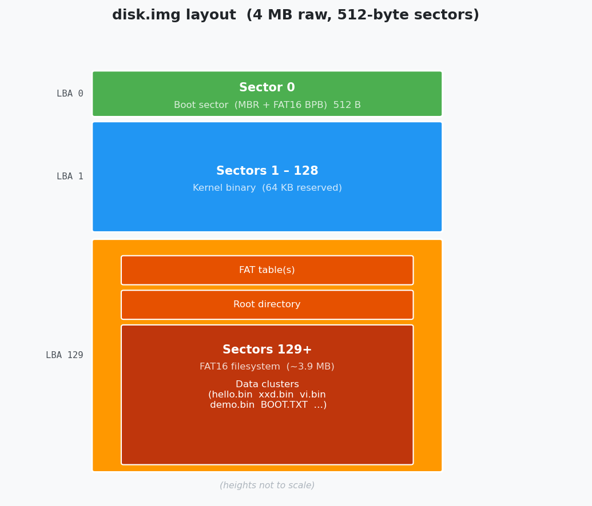
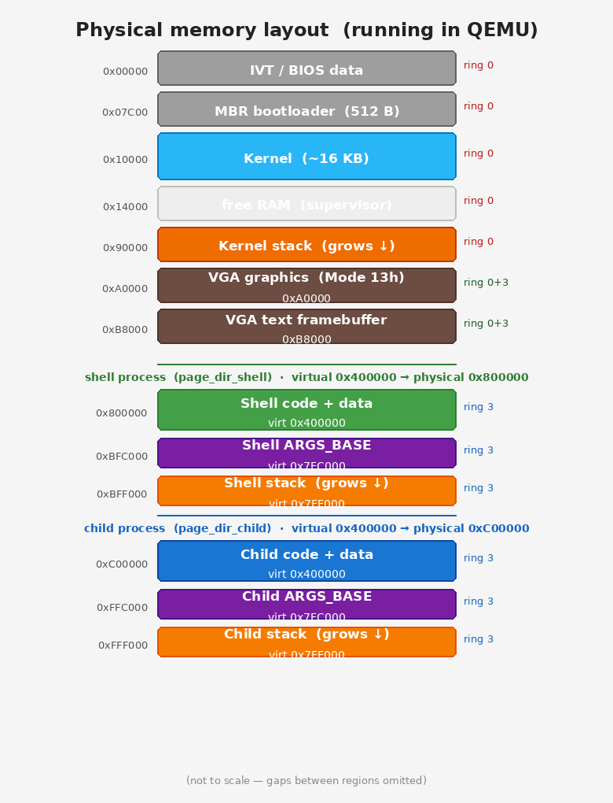

# YOLO-OS

A minimal bare-metal x86 operating system for IBM PC, built from scratch.
Runs in QEMU. Educational and intentionally simple.

## Quick start

```bash
# Install dependencies (Debian/Ubuntu)
sudo apt install nasm gcc gcc-multilib binutils qemu-system-x86 dosfstools mtools python3-pexpect

# Build and run
make
make run

# Run automated tests
make test
```

---

## Architecture

- **CPU**: 32-bit protected mode; kernel in ring 0, user programs in ring 3
- **Paging**: per-process page tables; U/S bits enforce kernel/user separation; segfaults caught
- **Boot**: 16-bit MBR bootloader → ATA PIO LBA read → jumps to 32-bit kernel at `0x10000`
- **Video**: VGA text mode 80×25 (`0xB8000`); user programs may switch to Mode 13h graphics
- **Keyboard**: PS/2 polling, scan code set 1, US QWERTY, arrow keys supported
- **Filesystem**: FAT16 on the same IDE disk image, read/write via ATA PIO
- **Syscalls**: `int 0x80` (EAX=number, EBX/ECX/EDX=args, return in EAX)
- **Programs**: flat 32-bit binaries stored in `/bin` on FAT16, loaded into RAM at `0x400000`, run in ring 3

---

## Disk layout



The single `disk.img` (4 MB raw) holds both the kernel and the filesystem:

| Region | Content |
|--------|---------|
| Sector 0 | Boot sector — MBR code + FAT16 BPB (patched by `scripts/patch_boot.sh`) |
| Sectors 1 – 128 | Kernel binary (controlled by `KERNEL_SECTORS` in Makefile) |
| Sector 129+ | FAT16 filesystem — FAT tables, root directory (`BOOT.TXT`, `bin/`), data clusters |

User programs live in the `/bin` directory on the FAT16 partition (stored without the `.bin` extension).
`BOOT.TXT` in the root holds a persistent boot counter.

---

## Memory layout



Two physical memory slots are reserved for processes. Both the shell and any child program
link at virtual `0x400000`; per-process page tables map that virtual address to different
physical frames.

| Physical address | Content | Ring |
|-----------------|---------|------|
| `0x00000` | IVT / BIOS data area | 0 only |
| `0x07C00` | MBR bootloader (512 B) | 0 only |
| `0x10000` | Kernel (~16 KB) | 0 only |
| `0x90000` | Kernel stack top (grows down) | 0 only |
| `0xA0000` | VGA graphics framebuffer (Mode 13h, 320×200) | 0 + 3 |
| `0xB8000` | VGA text framebuffer (80×25) | 0 + 3 |
| `0x800000` | Shell binary (`/bin/sh`) — virtual `0x400000` in `page_dir_shell` | 3 |
| `0xBFC000` | Shell args area (`ARGS_BASE`) | 3 |
| `0xBFF000` | Shell stack top (grows down) | 3 |
| `0xC00000` | Child binary — virtual `0x400000` in `page_dir_child` | 3 |
| `0xFFC000` | Child args area | 3 |
| `0xFFF000` | Child stack top (grows down) | 3 |

---

## Shell

The kernel boots, loads `/bin/sh` into the shell slot (physical `0x800000`), and execs it.
All user interaction happens inside the shell process.

```
> ls                    # list files and dirs in cwd (dirs shown with trailing /)
> ls bin                # list contents of bin/
> cd bin                # enter a subdirectory (prompt changes to /bin> )
> cd ..                 # go up to parent
> hello                 # run /bin/hello
> xxd BOOT.TXT          # run /bin/xxd with argument "BOOT.TXT"
> vi notes.txt          # open notes.txt in the text editor
> demo                  # start the graphics demo
> mkdir docs            # create a subdirectory in cwd
> rm file.txt           # delete file (prompts y/N)
> mv foo.txt bar.txt    # rename within current directory
```

- Left/right arrow keys move the cursor within the current line
- Up/down arrows are ignored (no history)
- Prompt shows cwd when not at root: `/bin> `
- Programs are loaded from `/bin`; file syscalls inside the program use cwd

---

## User programs

All programs are freestanding 32-bit flat binaries linked at `0x400000`, run in ring 3.
They are stored in `/bin` on FAT16 without a file extension.
Include `bin/os.h` to get syscall wrappers — no libc, no linking required.

### sh

The interactive shell (first user process launched by the kernel).

### hello

Prints "Hello, World!" and exits.

### xxd

Hex dump of a file (16 bytes per line, ASCII sidebar).

```
> xxd BOOT.TXT
> xxd notes.txt
```

### vi

A vi-like text editor.

| Key | Action |
|-----|--------|
| Arrow keys | Move cursor |
| `i` | Enter insert mode |
| `o` | Open new line below, enter insert mode |
| `x` | Delete character under cursor |
| `Esc` | Return to normal mode |
| `:w` | Save |
| `:q` | Quit (refuses if unsaved) |
| `:q!` | Force quit |
| `:wq` / `:x` | Save and quit |

### demo

VGA Mode 13h (320×200, 256 colours) snow animation.
Press `q` to quit. The kernel automatically restores text mode on exit.

### ls

Lists files and directories in the current directory (or a given directory argument).
Directories are shown with a trailing `/`; files show their size in bytes.

### rm

Deletes a file or empty directory. Prompts `[y/N]` before removing.

### mkdir

Creates a subdirectory in the current directory.

### mv

Renames a file or directory within the current directory. Usage: `mv <src> <dst>`

### segfault

Deliberately writes to a kernel-only address (`0x1000`) to trigger a page fault.
The kernel prints "Segmentation fault" and returns to the shell.
Useful for verifying that ring-3 memory protection works.

---

## Adding a new user program

1. Create `bin/myprog.c`, include `bin/os.h`, implement `void main(void)`.
2. Add to `Makefile`:
   ```makefile
   USER_BINS += $(BUILD)/myprog.bin

   $(BUILD)/myprog.o: bin/myprog.c bin/os.h | $(BUILD)
       $(CC) $(CFLAGS) -c $< -o $@

   $(BUILD)/myprog.elf: $(BUILD)/myprog.o bin/user.ld
       $(LD) -m elf_i386 -T bin/user.ld $< -o $@

   $(BUILD)/myprog.bin: $(BUILD)/myprog.elf
       $(OBJCPY) -O binary $< $@
   ```
3. `make` and then run `myprog` in the shell.

Use `get_args()` to read the argument string passed after the program name.

---

## Syscall reference

Include `bin/os.h`. All functions are `static inline` wrappers around `int 0x80`.

---

```c
void exit(int code);
```
Terminate the program and return to the shell.

---

```c
int write(int fd, const char *buf, int len);
```
Write `len` bytes from `buf` to `fd`. Returns number of bytes written, or `-1` on error.
- `fd=1` — stdout: output appears on VGA and COM1 serial
- `fd≥2` — open file: data is accumulated in a 16 KB kernel buffer, flushed to disk on `close()`

---

```c
int read(int fd, char *buf, int len);
```
Read up to `len` bytes into `buf`. Returns number of bytes read, or `-1` on error.
- `fd=0` — stdin: blocks until newline; echoes typed characters; returns the whole line including `\n`
- `fd≥2` — open file: reads sequentially from current position

---

```c
int open(const char *path, int flags);
```
Open a file in the current directory. Returns a file descriptor (`≥2`), or `-1` on error.
- `flags=O_RDONLY` (0) — read: file is loaded into a kernel buffer
- `flags=O_WRONLY` (1) — write: creates the file if it does not exist, truncates if it does

---

```c
int close(int fd);
```
Close `fd`. Returns `0` on success, `-1` on error.
For `O_WRONLY` files: flushes the kernel buffer to FAT16 on disk.

---

```c
int get_char(void);
```
Blocking read of one raw keystroke; no echo. Returns the character as an `unsigned char` value.
Arrow keys return the following constants (defined in `os.h`):

| Constant | Value |
|----------|-------|
| `KEY_UP` | `0x80` |
| `KEY_DOWN` | `0x81` |
| `KEY_LEFT` | `0x82` |
| `KEY_RIGHT` | `0x83` |

---

```c
int get_char_nonblock(void);
```
Non-blocking variant of `get_char`. Returns `0` immediately if no key is available.

---

```c
void set_pos(int row, int col);
```
Move the VGA hardware cursor. `row`: 0–24, `col`: 0–79.

---

```c
int getpos(void);
```
Return the current VGA cursor position as `row * 256 + col`.

---

```c
void clrscr(void);
```
Clear the entire text screen and move the cursor to (0, 0).

---

```c
int readdir(struct direntry *buf, int max);
```
Fill `buf` with up to `max` entries from the current directory. Returns the count.
Each `struct direntry` has `char name[13]`, `unsigned int size`, `int is_dir`.

---

```c
int chdir(const char *name);
```
Change the current directory. Returns `0` on success, `-1` if not found.

---

```c
int unlink(const char *name);
```
Delete a file or empty directory. Returns `0`, `-1` (not found), or `-2` (directory not empty).

---

```c
int os_mkdir(const char *name);
```
Create a subdirectory in the current directory. Returns `0` or `-1`.

---

```c
int os_rename(const char *src, const char *dst);
```
Rename a file or directory within the current directory. Returns `0` or `-1`.

---

```c
int exec(const char *name, const char *args);
```
Load and run `/bin/<name>`, passing `args` as the argument string.
Returns the child's exit code, or `-1` if the program was not found.

---

```c
void outb(unsigned short port, unsigned char val);
unsigned char inb(unsigned short port);
```
Direct x86 I/O port access. Available from ring 3 because the kernel sets `IOPL=3` in `EFLAGS`.

---

## Automated tests

`make test` spawns QEMU headlessly and drives it via the serial port using pexpect.

| Test | What it checks |
|------|----------------|
| boot | OS boots, welcome message, shell prompt |
| unknown_command | unknown input prints "unknown command" |
| hello | `hello` output contains "Hello" |
| ls | `ls` shows `bin/` directory |
| xxd | `xxd BOOT.TXT` prints a hex dump |
| xxd_missing_file | `xxd NOSUCHFILE.TXT` prints "cannot open" |
| vi_quit | `vi test.txt` + `:q!` returns to shell |
| segfault | `segfault` prints "Segmentation fault" and returns to shell |
| fs_operations | `mkdir`, create file via `vi`, `rm` file, `rm` dir |

---

## Build targets

| Target | Description |
|--------|-------------|
| `make` | Build everything; create `disk.img` if missing |
| `make run` | Build and launch QEMU (serial output on stdout) |
| `make test` | Run automated test suite (requires `python3-pexpect`) |
| `make newdisk` | Wipe and recreate `disk.img` (needed after changing `KERNEL_SECTORS`) |
| `make clean` | Remove `build/` (keeps `disk.img`) |
